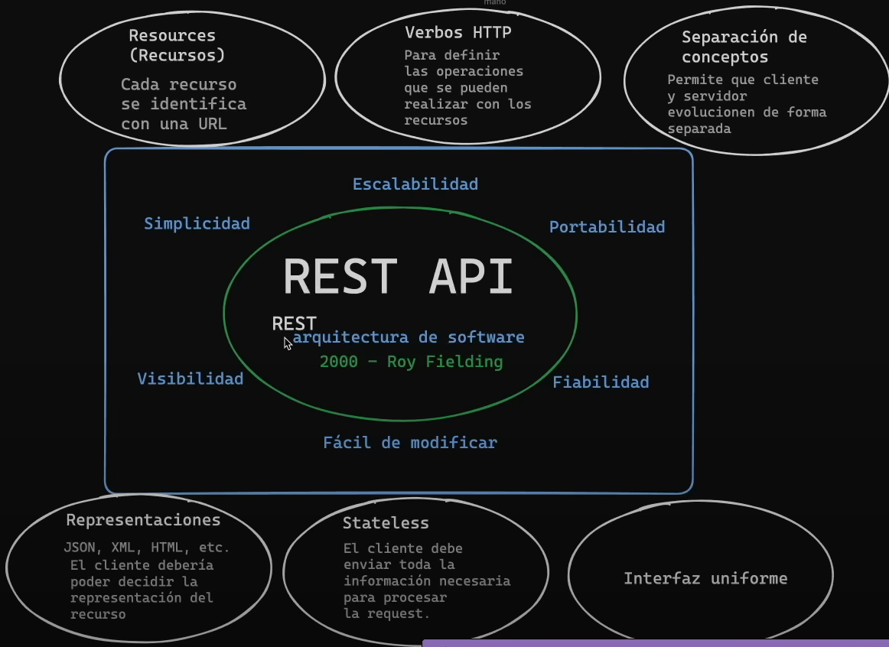

# NODE JS

- Para validar campos de un .json o de una API, podemos usar [zod](https://benoitpetit.dev/my-blog/1334338)
- para convertir una ruta a regex sin tener que hacerlo manualmente: [path to regex](https://github.com/pillarjs/path-to-regexp)



### PATCH vs PUT vs POST


### [Solución a CORS](https://youtu.be/-9d3KhCqOtU?si=KbtjmGtuG5nzFCoy&t=4422)

### Como leer un json en ESModules

```java
import { createRequire } from "node:module"
const require = createRequire 
```

### Pasar cadena vs número

- Parece una tontería, pero me demoré horas en encontrar este problema

Cadena


Número


### Otra forma de conectarse con Node

Instalar: `npm i nodemon -g`

Iniciar `nodemon app`

### Establecer un middleware para una ruta específica

No se coloca app.use(customMiddleware), en cambio se coloca después de la ruta y después de una coma

```jsx
const express = require('express')
const app = express()
const PORT = 5000

const customMiddleware = (req, res, next) => {
    console.log('custom middleware')
    next()
}

app.get('/', (req, res, next) => {
    console.log('home')
    res.send('hello world')
})

app.get('/about', customMiddleware, (req, res, next) => {
    console.log('about')
    res.send('about page')
})

app.listen(PORT, () => {
    console.log('server is running on', PORT)
})
```

### [Encriptar contraseñas](https://www.npmjs.com/package/bcrypt)


